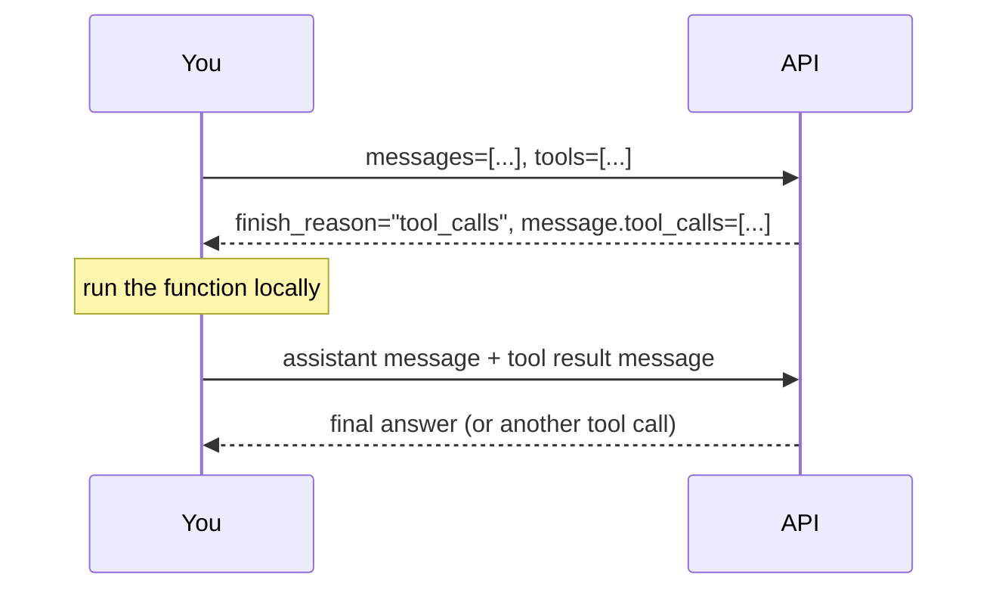

# Lesson 1: Tools and the Agent Loop

## The Problem

A language model is a closed box. You send it text. It sends text back. That's the whole interface.

This works until you need the model to *do* something: read a file, write to disk, search the web, send an email. The model's weights were frozen at training time. It can *reason* about how to do these things but it cannot *do* them. It can describe how to read a file but it cannot open one.

For the first couple of years of the LLM era, developers worked around this with increasingly elaborate prompt engineering: paste the current date into the system prompt, include a chunk of search results manually, pre-compute whatever facts the model might need. It worked, but it was brittle. You had to anticipate everything the model would need before the conversation started.

The insight that changed this: **what if the model could ask for what it needs?**

---

## A Simple Idea

Imagine you're the model. You're mid-answer and you realise you need to read a file to continue. You can't open it yourself, but the developer running you can. What if you just... asked them to?

```
I need to read the file before I can answer.

tool: read_file
params: {"path": "notes.txt"}
```

The developer's code sees this, opens `notes.txt`, and sends the content back:

```
tool_result: {"content": "Meeting agenda: 1. Q3 review 2. Roadmap...", "path": "notes.txt"}
```

Now you have what you need and can finish your answer.

That's it. That's the whole idea. A tool is a function you expose to the model so it can request a call. The model doesn't run anything. It just expresses intent in text. Your code does the actual work and feeds the result back into the conversation.

The format above is made up. We invented it for this explanation. Any format the model can emit consistently and your code can parse reliably would work. In the real world this was true for a while: early tool-calling systems each had their own conventions.

---

## The Agent Loop

Once you have tools, the natural next question is: what if the model needs to call more than one?

It reads a file. Decides it needs to write a summary. Reads another file to cross-reference. Writes the final output.

That's not one exchange. It's a loop. The model calls a tool, your code runs it and hands back the result, the model decides whether to call another tool or stop and answer. This continues until the model has enough to respond.

```
while model is not done:
    call the model
    if model wants a tool:
        run the tool
        give the model the result
    else:
        return the model's answer
```

An agent is just this loop. That's the entire architecture: an LLM with access to tools, running in a loop until the task is done. There's no magic.

What makes different agents different is: which tools they have, how many iterations they're allowed, how they handle errors, and how they decide when they're "done."

---

## ReAct: Reasoning + Acting

In 2022, a [paper called **ReAct** (Reasoning + Acting)](https://arxiv.org/abs/2210.03629) gave this pattern a formal framework and showed that it dramatically outperformed models that either reasoned without tools or called tools without reasoning.

The key idea in ReAct is that the model should alternate between **thought** (internal reasoning about what to do next) and **action** (calling a tool or producing output). Crucially, the model reasons *out loud* before each tool call, explaining why it's calling the tool, and then reasons again after seeing the result:

```
Thought: The user wants a summary of notes.txt. I should read it first.
Action: read_file("notes.txt")
Observation: {"content": "Meeting agenda: 1. Q3 review..."}

Thought: I have the content. I can now write a summary.
Answer: The notes cover three agenda items: Q3 review, roadmap planning...
```

This explicit reasoning step makes agents more reliable: the model has to commit to a plan before acting, which catches many errors before they happen. Modern LLMs are trained to do this naturally when given tools, without you needing to prompt for it explicitly.

---

## Implementing Your Own Format

Before looking at how the industry standardised this, you should feel the friction of doing it yourself. That's what Build 1 is.

The format we'll use: the model wraps its tool call in `<tool_call>` tags, and you wrap your response in `<tool_response>` tags. You instruct the model to use this format in the system prompt.

```
I need to read the file first.

<tool_call>
{"name": "read_file", "arguments": {"path": "notes.txt"}}
</tool_call>
```

Your code finds the tag, extracts the JSON, runs the function, and injects back:

```
<tool_response>
{"content": "Meeting agenda: Q3 review, roadmap...", "path": "notes.txt"}
</tool_response>
```

**Go work through Build 1 now.** The tasks are:

- Parse the `<tool_call>` block from the model's response using a regex
- Route the call to the right Python function (`read_file` or `write_file`)
- Feed the result back and loop until the model stops calling tools

Don't look ahead. Implement it, run it, break it. Once you've felt the rough edges of a hand-rolled format, you'll appreciate what the OpenAI spec gives you.

---

## Why a Standard?

By 2023, every major LLM provider had their own tool-calling convention. OpenAI used function calling with JSON. Anthropic used XML blocks. Google used their own schema. Each was subtly different, and code written for one didn't work for another.

This was a problem not just for portability, but for *reliability*. Models need to be trained on a format to produce it consistently. The more fragmented the ecosystem, the harder it is to train a model that's good at all of them.

The OpenAI function calling format became the de facto standard, not because it's perfect, but because the OpenAI models were good at it and the SDK made it easy. OpenRouter speaks the same format. Most modern models now support it out of the box.

Here's what a tool definition looks like in the standard:

```python
tools = [
    {
        "type": "function",
        "function": {
            "name": "read_file",
            "description": (
                "Read the contents of a file from disk. "
                "Call this whenever the user asks about the contents of a file, "
                "or when you need to read something before writing or summarising."
            ),
            "parameters": {
                "type": "object",
                "properties": {
                    "path": {
                        "type": "string",
                        "description": "The file path to read, e.g. 'notes.txt' or 'data/report.md'",
                    },
                },
                "required": ["path"],
            },
        },
    },
    {
        "type": "function",
        "function": {
            "name": "write_file",
            "description": (
                "Write content to a file on disk. Creates the file if it does not exist. "
                "Call this when the user asks you to save, write, or create a file."
            ),
            "parameters": {
                "type": "object",
                "properties": {
                    "path": {
                        "type": "string",
                        "description": "The file path to write to, e.g. 'output.txt'",
                    },
                    "content": {
                        "type": "string",
                        "description": "The text content to write into the file",
                    },
                },
                "required": ["path", "content"],
            },
        },
    },
]
```

Pass this as the `tools=` argument in your API call. The model reads these descriptions, decides when a tool is appropriate, and returns a structured `tool_calls` field in its response instead of (or before) its final answer.

---

## Why JSON?

The `parameters` field uses **JSON Schema**, the same format used to validate API payloads, describe database schemas, and generate form UIs. You write it once, and you get:

- **Validation for free.** The SDK can check that the model's arguments match the schema before you even see them.
- **Precise types.** `"type": "string"` versus `"type": "integer"` removes an entire category of bugs where you pass the wrong type to a function.
- **Enums.** `"enum": ["r", "w", "a"]` constrains the model to only valid values, rather than hoping it doesn't invent something unexpected.
- **Documentation.** The `description` on each property is the model's instruction manual for that argument. Write it like you're explaining the parameter to someone who doesn't know your codebase.

Compare this to the custom format from Build 1: your regex parser has no idea if the JSON the model emitted has the right fields until you try to call the function and it blows up. JSON Schema catches that earlier and more cleanly.

---

## The Conversation Flow

When you use the standard format, the conversation grows a new role: `"tool"`. The sequence looks like this:



The important detail: you **must** append the assistant message that contains `tool_calls` before appending the `tool` result message. The API expects to see the model's tool request and your response as a pair. Skipping the assistant message will cause an error.

In pseudocode, the agent loop looks like:

```
messages = [system_message, user_message]

repeat up to MAX_ITERATIONS times:
    response = call_api(messages, tools)

    if response wants a tool:
        append assistant message to messages
        for each tool_call in response:
            result = run_tool(tool_call.name, tool_call.arguments)
            append tool result to messages

    else:
        return response.text   <- the final answer

return "hit iteration limit"
```

The iteration cap is not optional. A confused model can loop forever on a bad task. Ten iterations is usually plenty; twelve or fifteen if you expect multi-step work.

**Build 2** has you implement this properly using the SDK. The goal is to end up with the same behaviour as Build 1 (same tools, same questions) but with cleaner, more reliable code and proper error handling at the schema level.

---

## Things to Think About

- **The description is the interface.** The model decides when to call a tool based purely on reading your `description` string. A vague description (`"reads a file"`) will be called inconsistently. A precise one (`"Call this whenever the user asks about the contents of a file, or when you need to read something before writing or summarising."`) will be called reliably. How would you write a description for a tool you never want the model to call unless explicitly asked?

- **Multiple tool calls per turn.** The model can return several `tool_calls` in one response. Should you run them in parallel or sequentially? What if one depends on the output of another?

- **Tool errors.** If the file doesn't exist and you return `{"error": "File not found: notes.txt"}`, what does the model do? Try it and see. Does it apologise, ask for clarification, or try a different path?

- **Security.** A `read_file` tool that accepts any path can read `/etc/passwd` if the model (or user) asks it to. How would you constrain the tool to only allow paths within a specific directory?

---

## Further Reading

- **ReAct: Synergizing Reasoning and Acting in Language Models**  
  <https://arxiv.org/abs/2210.03629>
- **OpenAI Function Calling Guide**  
  <https://platform.openai.com/docs/guides/function-calling>
- **JSON Schema: Getting Started**  
  <https://json-schema.org/learn/getting-started-step-by-step>
