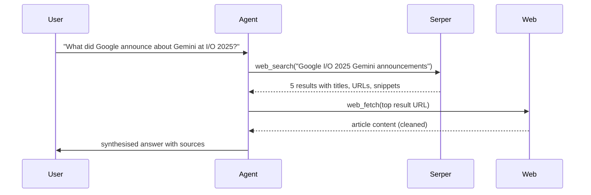

# Lesson 2: Web Tools: Fetch, Search, and llms.txt

The two most useful tools you can give any agent are a web fetcher and a web searcher. Together they let the model look up current information, verify facts, and follow a research trail, things a plain LLM call cannot do.

---

## Web Fetch

### The basic fetch

`requests` is the standard Python HTTP library. Every Python developer knows it:

```bash
pip install requests
```

```python
import requests

def web_fetch(url: str) -> str:
    """Fetch the content of a URL and return it as text."""
    headers = {"User-Agent": "Mozilla/5.0 (compatible; ResearchBot/1.0)"}
    response = requests.get(url, headers=headers, allow_redirects=True, timeout=10)
    response.raise_for_status()
    return response.text
```

The raw response is HTML, and HTML is toxic for LLMs. Tags, scripts, ads, nav bars, and cookie banners consume thousands of tokens before you reach anything useful.

### Converting HTML to clean text

Strip the noise with `markdownify` or `trafilatura`:

```bash
pip install markdownify trafilatura
```

**markdownify**: converts HTML to Markdown. Works well for structured pages:

```python
from markdownify import markdownify

def fetch_as_markdown(url: str) -> str:
    html = web_fetch(url)
    md = markdownify(html, heading_style="ATX", strip=["script", "style", "nav", "footer"])
    import re
    md = re.sub(r'\n{3,}', '\n\n', md).strip()
    return md
```

**trafilatura**: extracts the main article body, discarding sidebars, ads, and navigation. Better for news and blog content:

```python
import trafilatura

def fetch_clean(url: str) -> str:
    html = web_fetch(url)
    text = trafilatura.extract(html, include_comments=False, include_tables=True)
    return text or ""
```

Which to use? `trafilatura` for article extraction, `markdownify` when you want to preserve structure (documentation, wikis). Experiment with both.

### Truncating the result

A single page can be 50,000+ tokens. Truncate before returning it to the model:

```python
MAX_CHARS = 8000

def fetch_for_agent(url: str) -> str:
    content = fetch_clean(url)
    if len(content) > MAX_CHARS:
        content = content[:MAX_CHARS] + "\n\n[...truncated]"
    return content
```

Returning too much is worse than too little. It drowns the model's attention and wastes your token budget.

---

## llms.txt

Many websites now publish a file at `/llms.txt`, a plain-text overview of the site's content designed specifically for AI agents to read efficiently.

The convention is defined at <https://llmstxt.org/>. A typical `llms.txt` looks like:

```markdown
# Cloudflare Docs

> Cloudflare provides cloud services that protect and accelerate websites.

## Docs
- [Workers](/workers/): Build and deploy serverless code at the edge
- [Pages](/pages/): Deploy full-stack applications
- [R2](/r2/): Zero-egress object storage
- [AI Gateway](/ai-gateway/): Observe and control AI traffic
- [Workers AI](/workers-ai/): Run AI models at the edge

## API Reference
- [REST API](https://api.cloudflare.com/)
- [SDKs](https://developers.cloudflare.com/fundamentals/api/reference/sdks/)
```

The idea: instead of crawling a whole documentation site, an agent fetches `/llms.txt`, reads the overview, and navigates directly to the relevant section.

In your web fetch tool, you can check for `llms.txt` first:

```python
def smart_fetch(url: str) -> str:
    from urllib.parse import urlparse
    base = f"{urlparse(url).scheme}://{urlparse(url).netloc}"

    try:
        resp = requests.get(f"{base}/llms.txt", timeout=5)
        if resp.status_code == 200:
            return f"[llms.txt found]\n\n{resp.text}\n\n---\nOriginal URL: {url}"
    except Exception:
        pass

    return fetch_for_agent(url)
```

---

## Web Search with Serper

`requests.get("https://google.com/search?q=...")` does not work. Google blocks scrapers. You need a search API.

**Serper.dev** gives you 2,500 free searches per month, returns clean JSON, and needs no credit card.

1. Sign up at <https://serper.dev>
2. Copy your API key
3. Add to `.env`: `SERPER_API_KEY=your_key_here`

```python
import requests
import os

SERPER_API_KEY = os.environ["SERPER_API_KEY"]

def web_search(query: str, num_results: int = 5) -> list[dict]:
    """Search the web. Returns a list of {title, link, snippet} dicts."""
    response = requests.post(
        "https://google.serper.dev/search",
        headers={"X-API-KEY": SERPER_API_KEY, "Content-Type": "application/json"},
        json={"q": query, "num": num_results},
        timeout=10,
    )
    response.raise_for_status()
    data = response.json()

    results = []
    for item in data.get("organic", []):
        results.append({
            "title": item.get("title", ""),
            "link": item.get("link", ""),
            "snippet": item.get("snippet", ""),
        })
    return results
```

Return a list of small dicts, not the full response. The agent only needs title, URL, and snippet to decide which pages to visit next.

### Chaining search and fetch

The power comes from combining them. An agent that can search then read then search again can answer questions that require navigating multiple sources:



This is why the iteration cap matters: a misconfigured agent can fetch page after page indefinitely.

### The tool definition

```python
search_tool = {
    "type": "function",
    "function": {
        "name": "web_search",
        "description": (
            "Search the web for current information. Use this when the user asks "
            "about recent events, specific facts, or anything you are uncertain about. "
            "Returns a list of search results with titles, URLs, and snippets."
        ),
        "parameters": {
            "type": "object",
            "properties": {
                "query": {
                    "type": "string",
                    "description": "The search query. Be specific and targeted.",
                }
            },
            "required": ["query"],
        },
    },
}

fetch_tool = {
    "type": "function",
    "function": {
        "name": "web_fetch",
        "description": (
            "Fetch and read the full content of a web page. Use this after web_search "
            "to read a specific result in detail. Prefer this for documentation, articles, "
            "and pages where the snippet is not enough."
        ),
        "parameters": {
            "type": "object",
            "properties": {
                "url": {
                    "type": "string",
                    "description": "The full URL to fetch, including https://",
                }
            },
            "required": ["url"],
        },
    },
}
```

---

## Things to Think About

- **Rate limits and politeness.** If your agent fetches 20 pages in rapid succession, sites may block it. What would a polite fetch loop look like, and what's the right delay?

- **Dynamic pages.** `requests.get` runs no JavaScript. Pages that load content dynamically (React, Angular SPAs) return an empty shell. What do you do when a page you need is dynamic? (Look up `playwright` if curious.)

- **Content quality.** Not every search result is worth fetching. How would you teach the model to prioritise authoritative sources (official docs, known publishers) over forums or low-quality aggregators?

- **Token budgeting.** Your fetch returns 8,000 characters. Your model has a 32K context window. You have conversation history, a system prompt, and search results already in there. At what point does fetch start crowding out earlier context?

---

## Resources

- **requests docs**: <https://requests.readthedocs.io/>
- **trafilatura**: <https://trafilatura.readthedocs.io/>
- **llms.txt spec**: <https://llmstxt.org/>
- **Serper API docs**: <https://serper.dev/api-reference>
