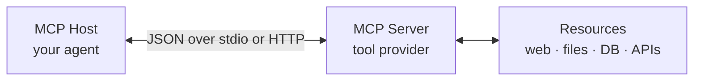

# Lesson 3: Introduction to MCP

## The Problem MCP Solves

Every AI application that needs tools reinvents the same wheel: write tool definitions, write the dispatcher, handle errors, format results, repeat for every new agent and every new tool.

If you build a web search tool for your research agent, it can't be used by someone else's coding agent without rewriting it for their format. Your tool definitions are locked to the model and SDK you chose.

**Model Context Protocol (MCP)** is a standard that decouples tools from applications. A tool server built to MCP spec works with any MCP client, regardless of which model is running underneath.

Think of it as USB for AI tools. You write the tool once, expose it as an MCP server, and any compliant agent can plug in and use it.

---

## Architecture

MCP has three components:



- **Host**: the agent/client that wants to use tools (your code, Claude Code, Cursor)
- **Server**: a process that exposes tools over a standard transport (stdio, HTTP/SSE)
- **Transport**: how they talk. Usually stdin/stdout for local tools, HTTP for remote

The host discovers available tools by sending a `tools/list` request. It calls a tool with `tools/call`. The server handles it and responds. The host is never aware of implementation details.

---

## A Minimal MCP Server in Python

The `mcp` Python SDK makes this straightforward:

```bash
pip install mcp
```

```python
# server.py
from mcp.server import Server
from mcp.server.stdio import stdio_server
from mcp.types import Tool, TextContent
import requests
import asyncio

app = Server("web-tools")

@app.list_tools()
async def list_tools() -> list[Tool]:
    return [
        Tool(
            name="web_fetch",
            description="Fetch the text content of a URL.",
            inputSchema={
                "type": "object",
                "properties": {
                    "url": {"type": "string", "description": "The URL to fetch"},
                },
                "required": ["url"],
            },
        )
    ]

@app.call_tool()
async def call_tool(name: str, arguments: dict) -> list[TextContent]:
    if name == "web_fetch":
        url = arguments["url"]
        response = requests.get(url, timeout=10)
        response.raise_for_status()
        return [TextContent(type="text", text=response.text[:4000])]

    raise ValueError(f"Unknown tool: {name}")

async def main():
    async with stdio_server() as streams:
        await app.run(*streams, app.create_initialization_options())

if __name__ == "__main__":
    asyncio.run(main())
```

Run it: `python server.py`

The server speaks MCP over stdin/stdout. A client connects to it by spawning the process and communicating through those pipes.

---

## Connecting a Client (Local Server)

To use your local server from a Python agent:

```python
from mcp import ClientSession, StdioServerParameters
from mcp.client.stdio import stdio_client
import asyncio

async def run():
    server_params = StdioServerParameters(
        command="python",
        args=["server.py"],
    )

    async with stdio_client(server_params) as (read, write):
        async with ClientSession(read, write) as session:
            await session.initialize()

            tools_result = await session.list_tools()
            print("Available tools:", [t.name for t in tools_result.tools])

            result = await session.call_tool("web_fetch", {"url": "https://example.com"})
            print(result.content[0].text[:500])

asyncio.run(run())
```

---

## Using an Online MCP Server with the OpenAI SDK

Many MCP servers are hosted online and served over HTTP, not stdio. The pattern for connecting is different, but the key insight is the same: you fetch the tool list, run your agent loop with those tools, and delegate tool calls back to the MCP server.

Here's how to bridge an online MCP server into an OpenAI SDK agent loop:

```python
import asyncio
import json
import os
from mcp import ClientSession
from mcp.client.sse import sse_client
from openai import OpenAI
from dotenv import load_dotenv

load_dotenv()

openai_client = OpenAI(
    base_url="https://openrouter.ai/api/v1",
    api_key=os.environ["OPENROUTER_API_KEY"],
)

MCP_SERVER_URL = "https://mcp.example.com/sse"   # replace with real server URL

async def run_agent_with_mcp(user_message: str):
    async with sse_client(MCP_SERVER_URL) as (read, write):
        async with ClientSession(read, write) as session:
            await session.initialize()

            # 1. Discover tools from the MCP server
            mcp_tools = await session.list_tools()

            # 2. Convert MCP tool definitions to OpenAI format
            openai_tools = []
            for tool in mcp_tools.tools:
                openai_tools.append({
                    "type": "function",
                    "function": {
                        "name": tool.name,
                        "description": tool.description,
                        "parameters": tool.inputSchema,
                    },
                })

            messages = [{"role": "user", "content": user_message}]

            # 3. Agent loop
            for _ in range(10):
                response = openai_client.chat.completions.create(
                    model="deepseek/deepseek-v4-flash:free",
                    messages=messages,
                    tools=openai_tools,
                )
                message = response.choices[0].message
                messages.append(message)

                if not message.tool_calls:
                    return message.content

                # 4. For each tool call, delegate to the MCP server
                for tool_call in message.tool_calls:
                    args = json.loads(tool_call.function.arguments)
                    result = await session.call_tool(tool_call.function.name, args)
                    content = result.content[0].text if result.content else ""
                    messages.append({
                        "role": "tool",
                        "tool_call_id": tool_call.id,
                        "content": content,
                    })

            return "Hit iteration limit."

if __name__ == "__main__":
    answer = asyncio.run(run_agent_with_mcp("Search for recent papers on LLM tool use"))
    print(answer)
```

The key steps are:
1. Connect to the online MCP server over SSE
2. Fetch its tool list and reformat it as OpenAI tool schemas
3. Run the standard agent loop using the OpenAI SDK
4. When the model calls a tool, forward the call to the MCP server and return the result

This pattern lets you use any MCP-compatible tool server without knowing anything about its internals.

### AlphaXiv MCP

[AlphaXiv](https://www.alphaxiv.org) is a platform for exploring and discussing arXiv papers. It exposes an MCP server that lets an AI agent search for papers, read abstracts, and retrieve full paper content.

This is a practical tool for the project: instead of searching Google for AI research, your agent can query AlphaXiv directly and get structured paper data.

See the AlphaXiv MCP documentation for the server URL and available tools:  
<https://www.alphaxiv.org/docs/mcp>

---

## MCP in the Wild

MCP is gaining rapid adoption. You may have already encountered it without knowing:

- **Claude Code** uses MCP to expose tools to Claude when you use it in agentic mode. `claude --mcp-server` connects a server you define
- **Cursor and Windsurf** support MCP servers so you can give your editor agent custom tools
- There are pre-built MCP servers for: GitHub, Slack, Postgres, Puppeteer (browser control), filesystem access, and dozens more

The MCP registry at <https://github.com/modelcontextprotocol/servers> is worth browsing.

---

## MCP vs. Manual Tool Calling

| | Manual (OpenAI format) | MCP |
|---|---|---|
| **Learning curve** | Low, just Python dicts | Higher, async typed protocol |
| **Portability** | Tied to your code | Any MCP client can use it |
| **Best for** | Project-specific tools | Reusable, shared tools |
| **Debugging** | Easy, all in one process | Harder, separate process, stdio |

For this week's project, manual tool calling is fine. Understanding MCP matters because it's becoming the standard for how AI systems consume capabilities. You'll see it everywhere in production agents.

---

## Things to Think About

- **Trust boundaries.** An MCP server runs as a separate process with its own permissions. If you connect to a third-party MCP server, what can it do to your system? What should a minimal-trust model look like?

- **Tool discovery as a surface.** The `tools/list` response tells the model what's available. If you have 50 tools, do they all fit in context? Should you filter or paginate the tool list based on what the user is doing?

- **MCP vs. RAG.** MCP also supports `resources`, structured data a server exposes for retrieval. How does that differ from a retrieval-augmented generation (RAG) pipeline? When would you use one vs. the other?

---

## Resources

- **Anthropic's MCP Introduction**: <https://www.anthropic.com/news/model-context-protocol>
- **MCP Specification**: <https://spec.modelcontextprotocol.io/>
- **Python MCP SDK**: <https://github.com/modelcontextprotocol/python-sdk>
- **MCP Server Registry**: <https://github.com/modelcontextprotocol/servers>
- **AlphaXiv MCP**: <https://www.alphaxiv.org/docs/mcp>
